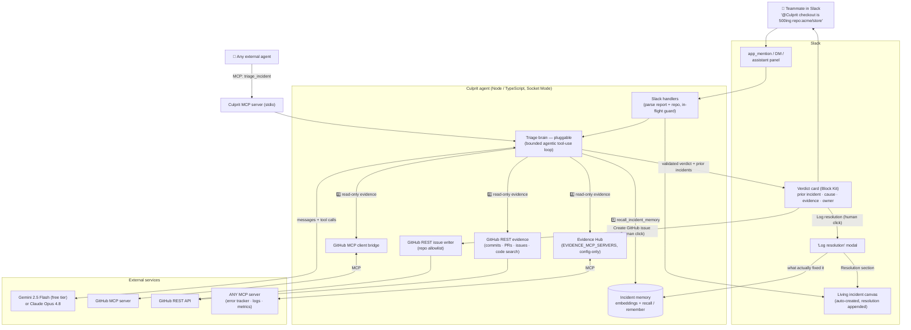
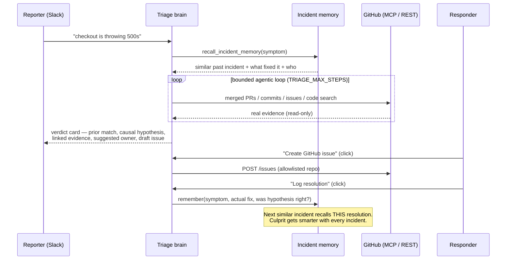

# Culprit — Architecture

## The compounding loop (what makes Culprit different)

## Design decisions

- **Memory first, then git.** The strongest triage lead is "we solved this before" —
  recall runs before any code archaeology, and the verdict's confidence is raised only
  when memory and evidence corroborate each other. Resolved incidents are embedded
  (`gemini-embedding-001`) with a lexical fallback so recall degrades, never fails.
- **The learning loop closes in Slack.** "Log resolution" captures what *actually* fixed
  the incident and whether the hypothesis was right — so confidence is earned from
  outcomes, not guessed. Institutional knowledge stops evaporating in threads.
- **MCP on both sides.** Culprit consumes the GitHub MCP server as a read-only evidence
  source *and* serves its own `triage_incident` MCP tool, so any other agent can reuse it.
- **Read over MCP, write over REST — with an allowlist.** The autonomous loop is
  read-only; filing an issue is an explicit human click, restricted to allowlisted repos
  (no confused-deputy).
- **Pluggable brain.** `LLM_PROVIDER` switches between the free-tier Gemini path
  (evidence over GitHub REST) and Claude (evidence over the GitHub MCP server) — same
  prompt, same structured `submit_triage` finalizer, same memory.
- **Socket Mode** — outbound WebSocket only; runs behind a corporate firewall with no
  public URL.
- **Output designed to industry benchmark.** Categorical confidence (never percentage
  bars), one severity signal, numbered evidence links verifiable in under 30 seconds,
  and a living Canvas as the durable incident record — following the conventions of
  incident.io, Rootly, Datadog, and Slack's own Block Kit guidance.
- **Honest scope.** Every claim cites a source Culprit actually retrieved; the card says
  "hypothesis, not a verdict" and means it.
