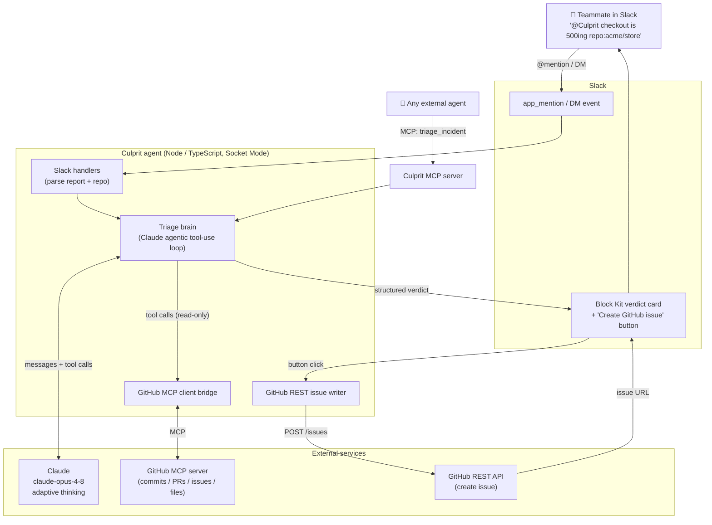
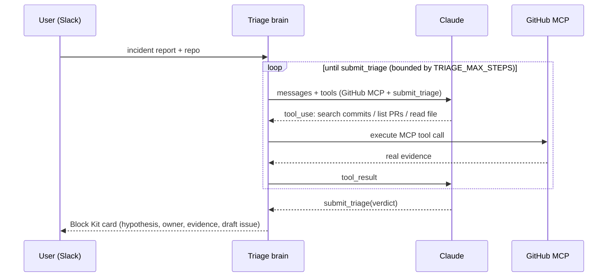

# Culprit — Architecture

## The agentic loop (how a verdict is formed)

## Design decisions

- **Socket Mode** — outbound WebSocket only, so Culprit runs anywhere (incl. behind
  a corporate firewall) with no public URL or inbound rule.
- **MCP on both sides** — consumes the GitHub MCP server for evidence; exposes its
  own `triage_incident` MCP tool so other agents can reuse Culprit.
- **Read over MCP, write over REST** — the autonomous loop is read-only; filing an
  issue is a deterministic, explicit, human-clicked action.
- **Structured finalizer (`submit_triage`)** — guarantees a validated, render-ready
  verdict instead of free-form prose, and bounds the loop.
- **Honest scope** — every claim cites evidence the agent actually retrieved;
  confidence is calibrated to how much evidence was found.
